# 2025年十五大最佳搜索引擎API工具精选列表(全新整理)

做SEO监测、价格追踪或市场研究时,最头疼的就是手动采集搜索结果数据,不仅效率低还容易被反爬虫机制封禁。专业的SERP API服务能帮你自动化抓取Google、Bing等搜索引擎的实时结果,99.9%成功率、毫秒级响应速度、结构化JSON数据输出,让你专注业务分析而不是维护爬虫代码。无论是SEO机构需要批量追踪关键词排名,电商团队要监控竞品价格,还是开发者构建智能搜索应用,这份榜单覆盖从低成本到企业级的15种解决方案,帮你找到最适合项目规模和预算的API工具。

## **[SearchAPI](https://www.searchapi.io)**

实时SERP抓取的Google搜索API,按成功请求计费的透明定价模式。

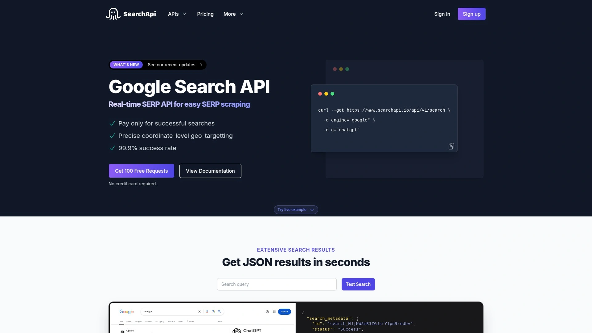

SearchAPI是一家位于纽约的数据服务公司,专注于将公开数据转换为结构化JSON格式。平台核心价值在于处理网页抓取中的复杂技术问题,让用户无需维护解析器或担心被封禁。

服务的技术架构确保高可靠性,成功率达到99.9%,支持精确到坐标级别的地理定位。响应速度方面,单次请求的处理时间约1.25秒,解析时间仅0.07秒,总耗时控制在1.32秒内。返回的JSON数据包含搜索元数据、搜索参数和详细的搜索结果信息,每个字段都经过标准化处理便于程序调用。

**应用场景**广泛覆盖多个行业。电商企业用于价格监控,实时追踪竞争对手的产品定价变化。SEO机构利用它追踪客户网站的关键词排名表现,生成定期报告。销售线索生成团队通过搜索结果挖掘潜在客户信息。通用数据挖掘项目则借助API批量获取公开数据进行分析。

与LangChain等AI框架深度集成,开发者可以将SearchAPI作为工具嵌入到智能体工作流中。Microsoft Power Automate的连接器支持让非技术用户也能通过可视化流程使用SearchAPI功能。部署在AWS云基础设施上,保证服务的稳定性和可扩展性。

定价模式采用按成功请求付费,避免了为失败请求买单的不合理情况。支持多种搜索引擎包括Google及其产品(购物、新闻、图片等),满足不同数据源的需求。API文档完善,提供cURL、Python、JavaScript等多种语言的示例代码,降低接入门槛。

## **[SerpAPI](https://serpapi.com)**

行业标杆级的Google搜索API,支持100多个搜索引擎和位置服务。

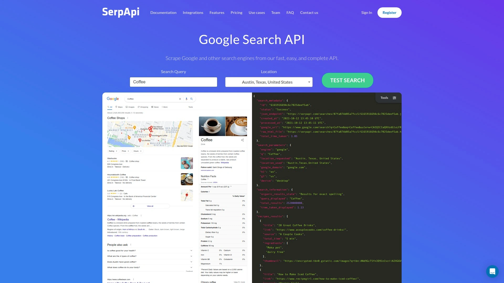

SerpAPI是SERP API领域的知名服务商,以其稳定性和完整的功能集受到开发者青睐。平台支持超过100个不同的搜索引擎,不仅限于Google,还包括Bing、Yahoo、Yandex等国际搜索引擎。

**数据完整性**是SerpAPI的核心优势之一,返回的JSON结果包含有机搜索结果、付费广告、知识图谱、相关问题、图片、视频等全部搜索元素。地理位置定位功能支持到城市级别,可以模拟从世界任何地方发起的搜索请求。

技术架构采用分布式代理池和智能重试机制,确保即使在搜索引擎更新反爬策略时仍能保持高成功率。提供历史搜索结果缓存功能,允许用户查询过去的搜索数据进行对比分析。

定价相对行业平均水平略高,每1000次请求约15美元起。但对于需要企业级稳定性和完整功能的项目,这个价格具有合理性。提供免费试用额度,新用户可以测试API是否满足需求后再决定付费。

客户案例涵盖SEO工具开发商、市场研究机构和数据分析平台,验证了其在生产环境中的可靠性。文档详尽且持续更新,社区活跃度高,遇到问题容易找到解决方案。

## **[Serper.dev](https://serper.dev)**

全球最快且最便宜的Google搜索API,专为LLM应用优化。

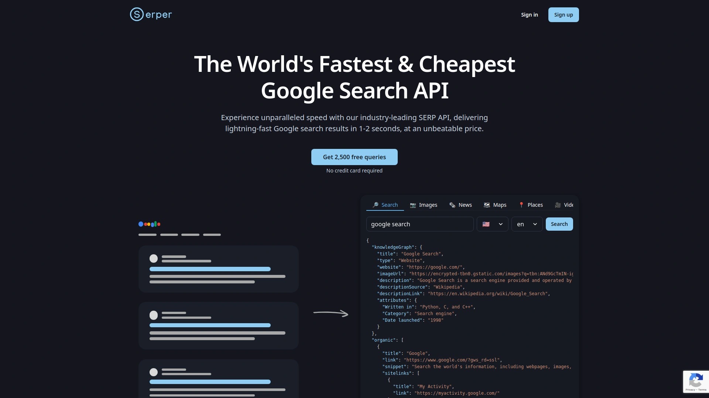

Serper在2022年推出后迅速成为市场上最受关注的SERP API之一,主打速度和性价比。平台特别针对大语言模型(LLM)应用场景进行了优化,成为LangChain和CrewAI等AI框架的推荐搜索工具。

**响应速度**经过第三方测试确认为行业最快,与Scrapingdog并列第一。这对于需要实时搜索结果的应用至关重要,比如聊天机器人需要快速回答用户问题,或者价格监控系统需要及时捕捉变化。

API设计简洁,默认搜索端点为`https://google.serper.dev/search`,支持country、location、locale和n_results等参数灵活控制搜索条件。集成到LangChain时只需几行代码,初始化GoogleSerperAPIWrapper后即可在ReAct Agent中使用。

定价策略极具竞争力,免费层提供一定额度供测试使用,付费计划根据使用量阶梯定价。CrewAI文档将其列为推荐的搜索工具,证明其在AI应用开发社区的认可度。

Serper Playground提供可视化界面,用户可以在浏览器中直接测试不同参数组合的搜索效果,无需编写代码。支持多种编程语言的SDK,包括Python、JavaScript、Go等,降低不同技术栈项目的集成难度。

## **[ScraperAPI](https://www.scraperapi.com)**

不仅是SERP API,更是全能型网页抓取解决方案。

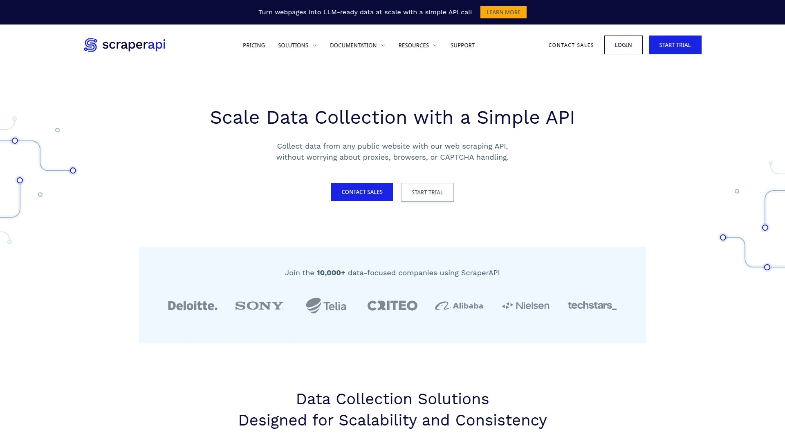

ScraperAPI提供的不仅仅是搜索引擎结果抓取,而是一整套网页数据采集基础设施。平台处理IP轮换、验证码破解、JavaScript渲染等复杂问题,让开发者专注数据应用而非抓取技术。

**SERP专用端点**支持Google、Bing等主流搜索引擎的结构化数据提取,返回JSON或CSV格式结果。除了标准的有机搜索结果,还支持Google购物、新闻、图片等垂直搜索的数据抓取。

相比SerpAPI,ScraperAPI在定价上更灵活,按API请求数计费而非按搜索引擎分别计价。JavaScript渲染功能是其技术优势,能够抓取依赖前端框架渲染的动态页面内容,这是许多传统SERP API不具备的能力。

客户包括Keyword.com和Seobility等知名SEO软件,证明其数据质量和稳定性达到商业应用标准。7天免费试用提供5000个API积分,足够评估服务是否适合项目需求。入门计划每月49美元包含10万次请求,高级计划支持更大规模使用。

合法性方面,抓取公开可见的搜索结果属于合法行为,但需要通过ScraperAPI这样的专业工具绕过反爬机制并保护IP安全。内置调度器功能允许设置定时任务,自动化执行周期性数据采集工作。

## **[Scrapingdog](https://www.scrapingdog.com)**

成本最低的SERP API,大规模使用时单价仅0.00029美元。

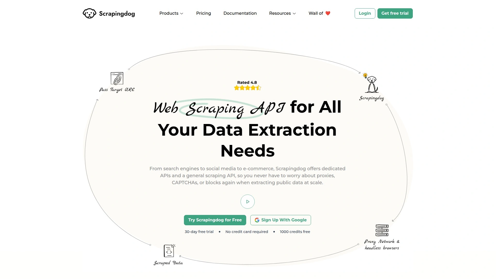

Scrapingdog在价格对比中表现极为突出,规模化使用时每次请求成本降至0.00029美元,远低于SerpAPI的0.015美元或Apify的0.003美元。速度测试显示其与Serper并列最快,而ScraperAPI是所有测试服务中最慢的。

**技术能力**覆盖Google SERP的全部功能,包括实时搜索、品牌监控、SEO优化、合规监控和消费者情绪分析等应用场景。品牌监控功能帮助企业追踪品牌在网络上的提及情况,及时管理声誉并响应相关讨论。

SEO优化场景中,通过分析关键词的搜索结果、广告位置和竞争对手的SEO策略,优化自身网站排名。区域合规监控对于多司法辖区运营的企业尤为重要,可以抓取不同地区的搜索结果确保合规性。

**用户体验**设计简洁,API接口友好,文档清晰。竞争分析工具让用户通过抓取搜索结果了解竞争对手在相同查询下的排名情况,绘制竞争格局图。内容缺口分析识别搜索结果中缺少的内容主题,指导内容创作方向。

广告效果追踪功能监测付费搜索广告的表现,优化投放策略。趋势检测通过持续抓取搜索结果,识别搜索查询模式的变化。排名追踪是SEO工具的核心功能,Scrapingdog提供准确的位置数据。

Reddit社区讨论中,多名用户推荐Scrapingdog作为SerpAPI的经济替代方案,认为其速度更快且价格更低。提供免费额度用于测试,付费计划根据使用量灵活定价。

## **[ValueSERP](https://app.valueserp.com)**

性价比之王的SERP API,每千次搜索仅需2.5美元起。

ValueSERP将自己定位为"全球最具价值的SERP API",主打低成本和高可靠性。定价从每1000次搜索2.5美元起,采用按需付费模式无需预付费。

**数据清洁度**高,无需手动编写规则或维护网页抓取器,API返回的数据直接可用。可扩展性强,能够适应不同规模的应用和项目需求。支持JSON、HTML和CSV三种数据格式输出,满足不同数据处理流程的要求。

位置和设备定向功能通过ValueSERP Locations API查询支持的Google搜索位置,并按设备类型过滤。获取本地化和有针对性的结果,让企业可以专注于特定市场的优化工作。

**批量处理**能力支持一次安排最多15000个请求,几分钟内返回结果。计划任务功能支持每月、每周、每日、每小时或手动按需运行,用户完全掌控数据采集时机。

数据自动投递功能将批量结果发送到用户定义的目标存储,支持Amazon S3、Google Cloud Storage、Microsoft Azure Blob Storage、阿里云OSS或任何S3兼容的对象存储。

AI Content Labs和Clay等多个平台提供了ValueSERP集成教程,证明其在营销自动化工具链中的实用性。在RapidAPI市场也有上架,方便开发者快速接入。

## **[Oxylabs SERP Scraper API](https://oxylabs.io)**

企业级SERP抓取平台,支持每分钟3000个结果的高并发。

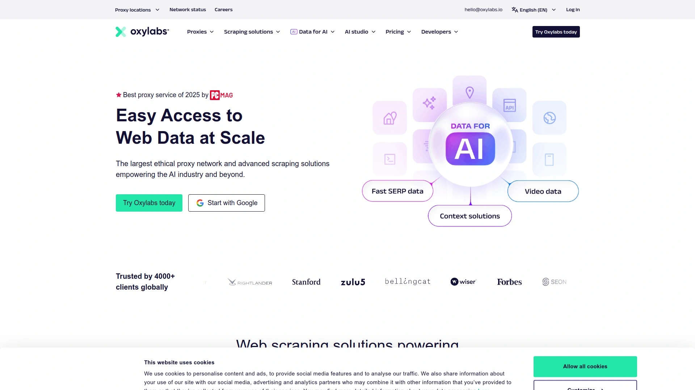

Oxylabs是网页抓取和代理服务的知名供应商,其SERP Scraper API定位于需要大规模数据采集的企业客户。平台支持Google的所有产品线,包括购物、新闻、趋势等专项搜索服务。

**性能指标**显示每分钟可处理3000个搜索结果,适合需要高频率数据更新的应用场景。批量处理功能支持一次提交最多5000个URL,大幅提升数据采集效率。

地理位置过滤精确到城市级别,语言和国家筛选让跨国企业能够获取特定市场的搜索数据。云端架构意味着无需自建基础设施,按需扩展计算资源。计划任务功能支持周期性数据采集,自动化日常监测工作。

**反封锁技术**是Oxylabs的核心竞争力,利用庞大的代理网络和智能轮换算法绕过搜索引擎的反爬限制。自定义解析器功能让技术能力强的团队可以独立编写解析指令,处理任何目标网站无需维护自己的解析器。

免费试用提供最多2000个搜索结果,付费计划最低每1000页1美元。虽然价格不是最便宜,但对于需要企业级支持和高级功能(如自定义解析、任务调度)的大型业务,Oxylabs是可靠选择。

按成功结果付费的模式意味着失败的请求不会产生费用,降低了因网络问题或目标网站故障导致的成本损失。适合需要大批量Google SERP数据提取、具备一定技术能力且预算充足的企业。

## **[Bright Data SERP API](https://brightdata.com)**

全球最大的代理网络支撑的SERP API,覆盖所有主流搜索引擎。

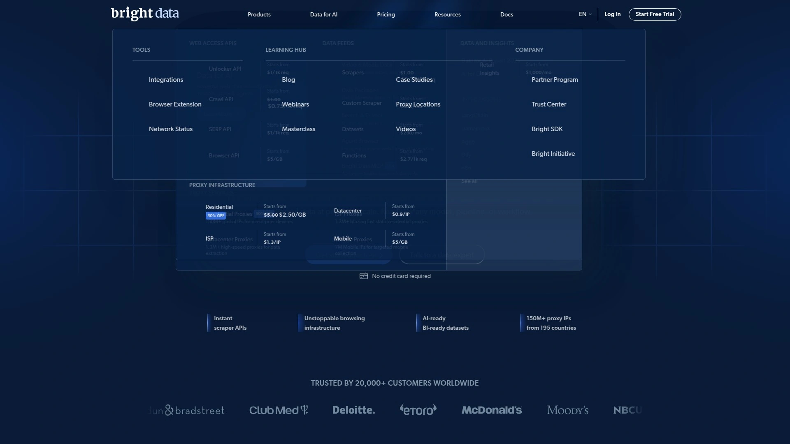

Bright Data(原Luminati)运营着全球最大的住宅代理网络,这为其SERP API提供了无与伦比的地理覆盖能力。Reddit用户在讨论SerpAPI替代方案时提到Bright Data的SERP API值得考虑。

平台支持的搜索引擎数量超过大多数竞争对手,不仅包括Google全系产品,还覆盖Bing、Yahoo、DuckDuckGo、Yandex、Baidu等国际搜索引擎。这对于需要多地区、多语言搜索数据的全球化企业特别有价值。

**代理网络优势**体现在能够模拟来自真实住宅IP的搜索请求,极大降低被识别和封禁的风险。支持移动设备、平板和桌面三种设备类型的搜索结果采集,满足移动优先时代的SEO分析需求。

数据收集器(Data Collector)工具提供无代码解决方案,非技术用户通过可视化界面配置采集任务。Web Unlocker功能专门处理高难度的反爬网站,自动解决验证码、IP封禁等问题。

定价基于使用量和所需功能的复杂度,通常高于纯粹的SERP API服务,但包含了完整的代理基础设施。提供企业级SLA保证,适合对服务稳定性有严格要求的关键业务应用。

客户支持团队提供24/7技术支持和专属客户经理(高级计划),帮助解决复杂的技术问题。适合需要全球覆盖、多搜索引擎支持和最高成功率的大型企业客户。

## **[Apify Google Search Scraper](https://apify.com)**

开源友好的云端抓取平台,按实际使用的计算资源付费。

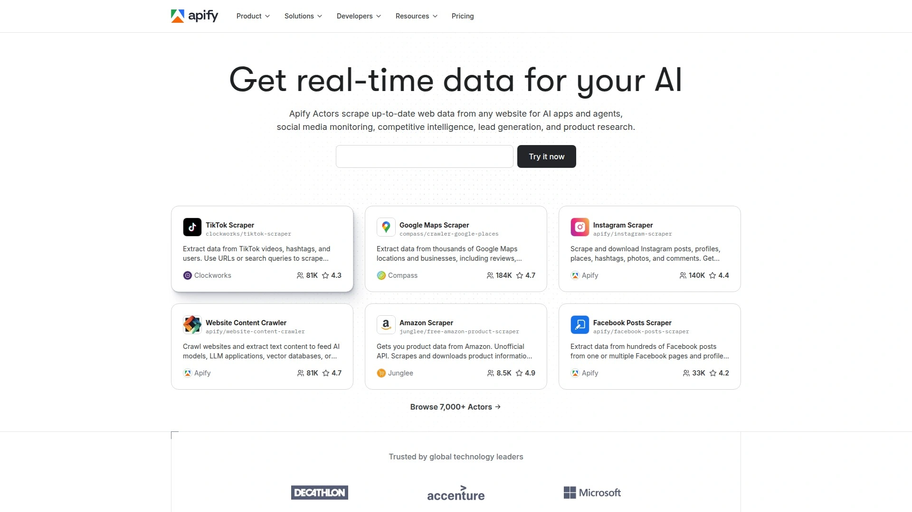

Apify是一个云端网页抓取和自动化平台,其Google Search Scraper是平台上最受欢迎的Actor之一。Actor是Apify对抓取任务的称呼,本质上是运行在云端的Docker容器。

**定价模式**基于实际消耗的计算资源(CPU和内存时间),而非按请求数计费。这对于单次抓取耗时短但频率高的任务更经济,每1000次请求约0.003美元。免费套餐提供一定的计算积分供测试使用。

开源社区活跃,Actor代码托管在GitHub上,用户可以查看源码、提出改进建议甚至Fork修改。支持本地运行Apify SDK,开发环境调试后再部署到云端,灵活性高。

**集成能力**强大,Apify提供Webhooks、调度器、数据存储和API等完整的自动化工具链。结果可以自动推送到Google Sheets、Dropbox、Slack等常用服务,构建端到端的数据流水线。

除了Google搜索,Apify平台还有数百个现成的Actor可用于抓取Amazon、LinkedIn、Twitter、Instagram等网站,适合需要多源数据采集的项目。文档详细且不断更新,社区论坛活跃,新用户容易找到帮助。

适合技术团队、需要灵活定制抓取逻辑、愿意学习平台生态系统的开发者。对于只需要简单SERP数据的场景,可能会觉得Apify功能过于复杂。

## **[DataForSEO](https://dataforseo.com)**

SEO数据聚合平台,不仅有SERP API还包含关键词和反链数据。

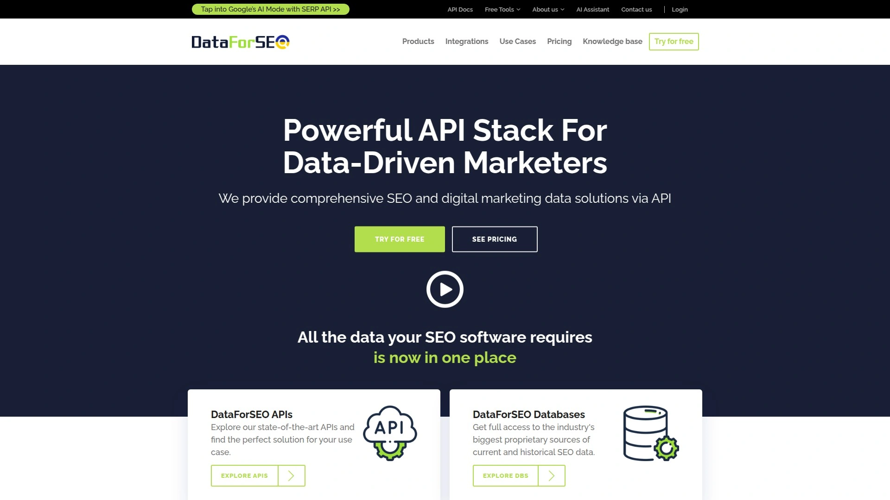

DataForSEO提供的不仅是SERP抓取,而是一整套SEO数据解决方案。除了搜索结果数据,平台还提供关键词搜索量、竞争度、反向链接分析、域名权威度等SEO工具常用的指标。

这种综合性数据源的优势在于,SEO工具开发商可以从单一供应商获取所有需要的数据,简化集成工作并降低管理成本。API端点覆盖Google、Bing、Yahoo等搜索引擎的SERP数据,以及Google Trends、Google Keyword Planner的关键词数据。

**数据新鲜度**是DataForSEO的卖点,声称提供实时和历史数据两种模式。实时模式即时抓取最新搜索结果,历史模式提供已缓存的数据快速返回且成本更低。批量任务处理适合周期性SEO监测,一次提交上千个关键词的排名查询。

定价相对透明,按不同API端点分别计价,实时SERP查询通常比缓存数据贵2-3倍。提供免费试用额度,让用户测试数据质量和API响应速度。文档完善,支持多种编程语言的示例代码。

客户群体以SEO软件开发商和数字营销机构为主,这些用户需要稳定的数据供应来支撑自己的SaaS产品或客户服务。适合需要全方位SEO数据而不仅是搜索结果的专业用户。

## **[Hasdata](https://hasdata.com)**

无代码SERP抓取器,可视化配置适合非技术用户。

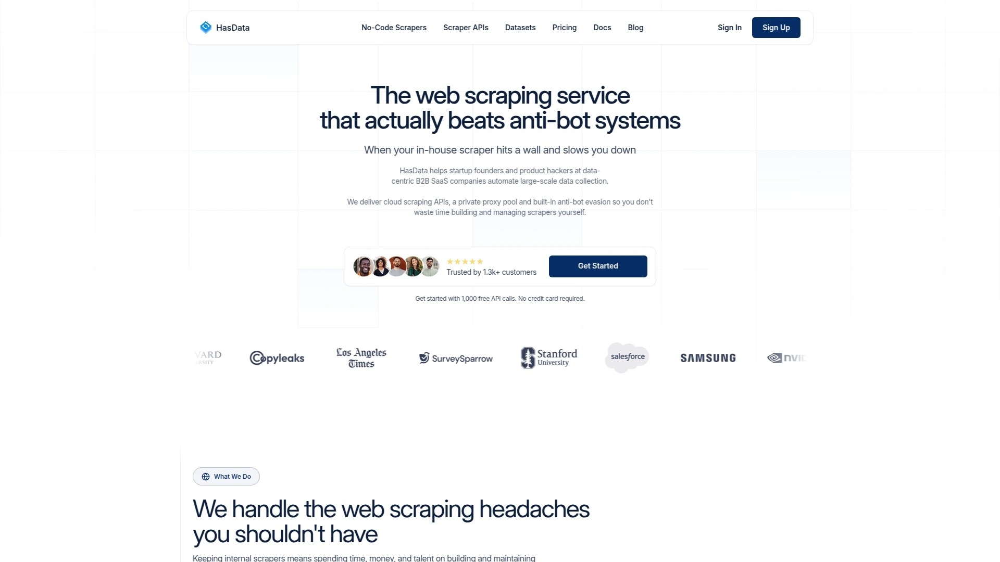

Hasdata的Google SERP Scraper采用无代码设计,用户通过图形界面配置抓取任务无需编写程序。这对于营销人员、SEO分析师等非技术背景的用户特别友好。

平台支持提取有机搜索结果、标题、描述等关键数据,用于SEO策略制定和关键词研究。可视化界面展示搜索结果,用户可以直观地查看和筛选数据,然后导出为Excel或CSV格式。

**计划任务**功能让用户设置每日、每周或每月的自动抓取,持续追踪关键词排名变化。数据存储在Hasdata云端,可以随时查看历史记录进行对比分析。

虽然功能没有编程接口那么灵活,但对于基本的SERP数据采集需求,Hasdata的易用性优势明显。定价按月订阅,不同套餐提供不同的抓取次数配额。

适合小型企业、个人SEO从业者、初创公司等没有开发资源但需要SERP数据的用户。对于需要深度定制或集成到自动化流程的场景,API类工具更合适。

## **[ScrapFly](https://scrapfly.io)**

注重隐私和合规的网页抓取服务,提供SERP API替代方案。

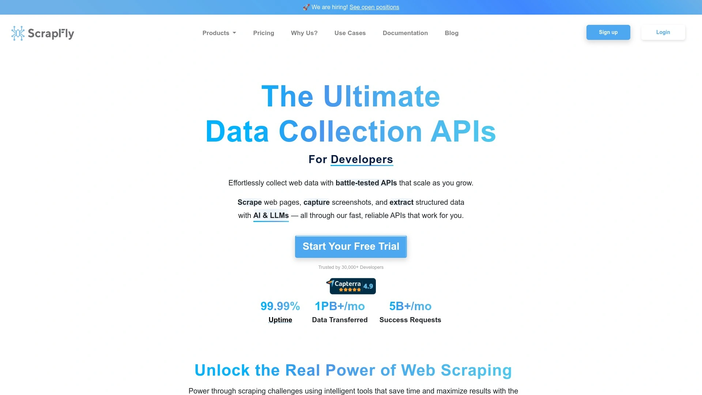

ScrapFly在讨论Google SERP API时提到,由于Google不提供官方的SERP API,开发者需要寻找替代方案。平台本身是一个通用网页抓取服务,支持JavaScript渲染、代理轮换和反封锁技术。

**替代搜索引擎API**是ScrapFly的推荐方向,包括Bing Search API、DuckDuckGo Instant Answer API、Yandex Search API和Brave Search API。这些官方API虽然不是Google,但提供合法合规的搜索数据访问途径。

Bing Search API由微软提供,支持网页、图片、新闻、视频和实体搜索,有详细文档和社区支持。DuckDuckGo API注重隐私保护,适合不需要个性化搜索结果的数据采集。

Yandex API对于需要国际市场特别是东欧地区搜索数据的项目有价值。Brave Search API提供独立于Google影响的搜索结果,适合需要替代视角的研究项目。

**技术建议**包括实施指数退避重试逻辑,检测403状态码应对速率限制。评估API定价、速率限制和数据质量时,需要在不同SERP供应商之间权衡。

ScrapFly的通用抓取能力也可以用于自建SERP抓取逻辑,虽然维护成本更高但对于有特殊需求的项目提供了最大灵活性。

## **[Zenrows](https://zenrows.com)**

现代化网页抓取API,智能反封锁引擎适合高难度网站。

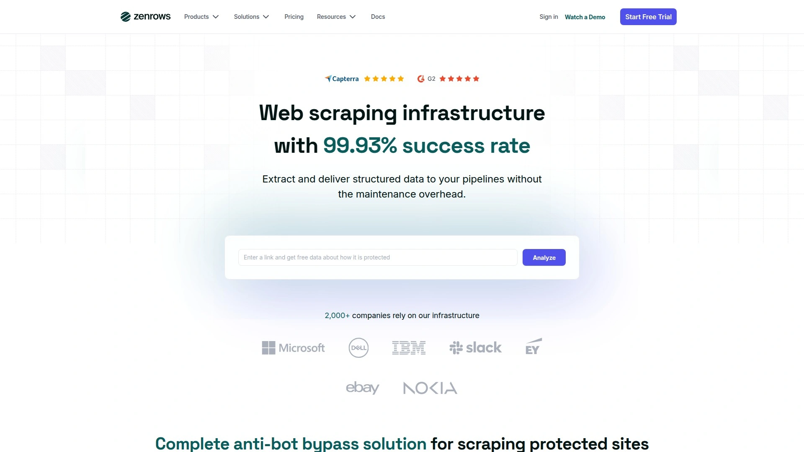

Zenrows是新一代网页抓取服务,虽然不是专门的SERP API,但其通用抓取能力可以应对包括搜索引擎在内的各类网站。平台的核心技术是智能反封锁引擎,自动选择最佳策略绕过目标网站的防护措施。

支持JavaScript渲染、自动重试、代理轮换等标准功能,定价基于成功请求数。API设计简洁,与ScraperAPI类似但界面更现代化。提供Chrome扩展和Playground工具,方便测试和调试抓取任务。

适合需要同时抓取搜索引擎和其他复杂网站的项目,统一使用一个服务商简化管理。对于仅需SERP数据的场景,专用SERP API可能性价比更高。

## **[Google Custom Search JSON API](https://developers.google.com)**

Google官方提供的可编程搜索引擎API,免费层每天100次查询。

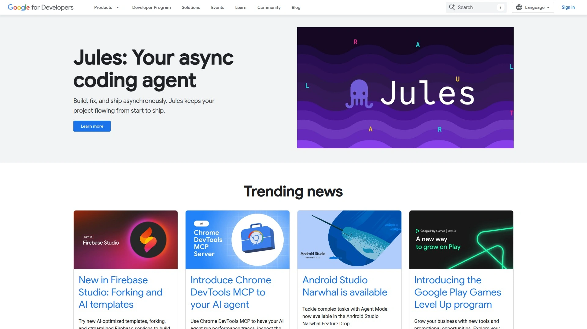

这是Google官方提供的唯一合法搜索API,但有严格的使用限制。用户需要先在控制面板创建可编程搜索引擎实例,获取Search Engine ID后通过API调用。

**免费配额**为每天100次搜索查询,超出部分按每1000次5美元计费,每日最多10000次查询。数据格式遵循OpenSearch 1.1规范,返回JSON结构。

需要注意的是,可编程搜索引擎是在用户定义的网站集合内搜索,而非全网搜索。如果配置为搜索整个网络,结果质量和覆盖面不如Google主搜索。

API密钥认证方式简单,将key=yourAPIKey附加到请求URL即可。适合个人项目、学术研究或低频率搜索需求的场景。对于商业应用和高频数据采集,第三方SERP API更合适。

## **[Bing Search API](https://microsoft.com/bing)**

微软官方搜索API,支持网页、图片、新闻等多类型搜索。

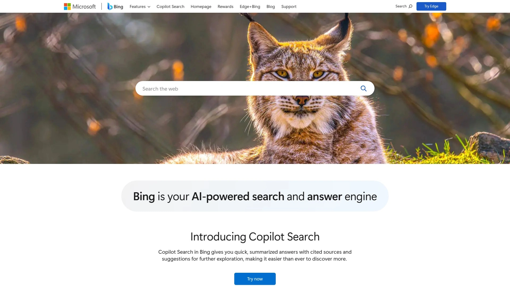

Bing Search API是除了Google Custom Search外另一个官方搜索API,由微软提供商业级支持。支持的搜索类型包括网页、图片、新闻、视频和实体搜索,功能完整。

**高级过滤选项**提供强大的排序和筛选能力,用户可以按相关性、日期、来源等维度定制结果。官方文档详尽,社区活跃,遇到问题容易找到解决方案。

认证使用`Ocp-Apim-Subscription-Key`请求头,需要在Azure门户订阅Bing Search服务获取密钥。定价按请求量阶梯计费,免费层提供有限配额用于测试。

虽然Bing的市场份额不如Google,但对于需要合法合规数据源的项目,官方API是最稳妥的选择。特别适合企业客户、需要服务等级协议(SLA)保障的生产环境。

结果质量在多数查询上接近Google水平,特别是在英文内容搜索上。对于国际化项目,Bing的多语言支持也很完善。

## **[Brave Search API](https://brave.com)**

隐私优先的独立搜索API,索引超过300亿网页。

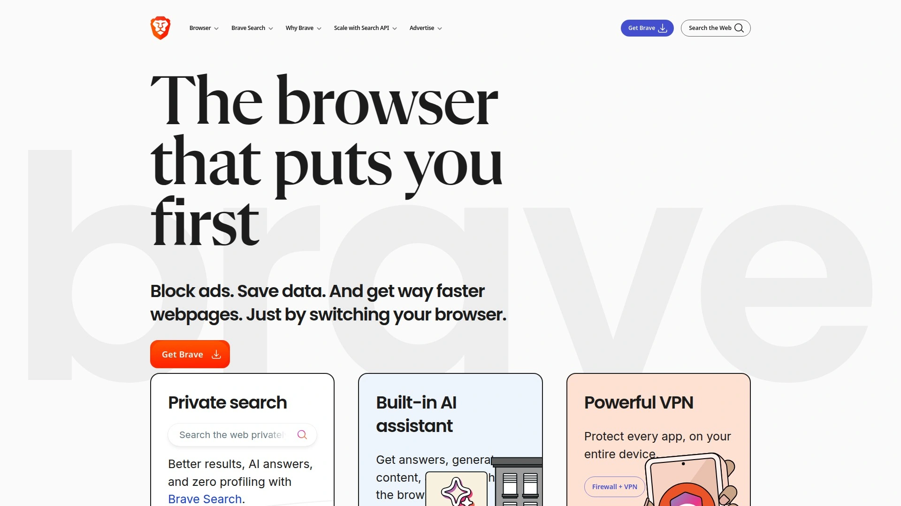

Brave Search API基于Brave自主构建的搜索索引,不依赖Google或Bing。索引规模超过300亿网页,每天更新超过1亿页面保持新鲜度。

**质量对比**盲测显示Brave Search性能与主流搜索巨头相当甚至更好。专用端点包括本地搜索、图片搜索、AI摘要等,适应不同应用需求。

Search Goggles功能是Brave的独特之处,允许用户丢弃特定域名或重新排序结果,实现对搜索结果的精细控制。额外片段(Extra Snippets)功能实时挑选最多5个片段,最大化与搜索查询的上下文相关性。

定价透明,按请求量计费,提供免费试用额度。适合重视数据隐私、希望使用独立搜索引擎的项目,或者需要与Google差异化结果的研究应用。

API文档清晰,支持RESTful调用和多种编程语言。响应速度快,适合实时搜索应用。对于全球化项目,Brave的多地区支持也在逐步完善。

## 常见问题

**使用SERP API抓取搜索结果合法吗?**

抓取公开可见的搜索结果数据在多数司法辖区属于合法行为,因为这些信息已经公开展示。但搜索引擎的服务条款通常禁止自动化抓取,所以直接爬取可能导致IP被封。专业SERP API服务通过合规的技术手段提供数据访问,使用它们是获取搜索数据的推荐方式。需要注意的是,抓取数据后的使用需遵守数据保护法规如GDPR,不能将个人数据用于未授权目的。

**如何选择适合项目的SERP API?**

首先明确需求场景和预算。如果是小型项目或初创团队,优先考虑Serper.dev、Scrapingdog等成本最低的选项,规模化后单次请求成本可降至0.0003美元以下。需要企业级稳定性和完整功能的项目,SerpAPI和Oxylabs是可靠选择尽管价格较高。评估时关注三个核心指标:响应速度(Serper和Scrapingdog最快)、成功率(主流服务都在99%以上)和数据完整性(是否包含所有SERP元素)。测试期间使用免费试用额度实际跑一些查询,验证返回数据是否满足需求。

**SERP API和网页抓取服务有什么区别?**

SERP API专门针对搜索引擎结果页面优化,返回结构化的JSON数据直接可用无需解析。通用网页抓取服务如ScraperAPI或Zenrows可以抓取任何网站包括搜索引擎,但需要自己编写解析逻辑提取所需字段。SERP API的优势在于维护成本低,供应商会应对搜索引擎的页面结构变化更新解析器。缺点是灵活性受限,只能获取API预定义的数据字段。通用抓取服务提供最大灵活性,可以提取任何页面元素,但需要持续维护解析代码。对于纯SERP数据需求,专用API更经济高效;需要同时抓取多种网站的项目,通用服务是更好选择。

## 结语

在众多搜索引擎API工具中,**[SearchAPI](https://www.searchapi.io)**凭借99.9%的成功率、精确到坐标级别的地理定位和按成功请求付费的透明定价,特别适合需要稳定可靠SERP数据的SEO机构、电商价格监控和数据分析项目。平台处理了网页抓取的所有技术复杂性,让团队专注于业务洞察而非维护爬虫代码,与LangChain和Power Automate的深度集成更是降低了AI应用开发和营销自动化的接入门槛。无论你是刚起步的个人开发者选择免费试用层,还是需要每天数百万次查询的企业客户,选择与项目规模、技术能力和预算匹配的API工具,才能在搜索数据驱动的业务中保持竞争优势。
